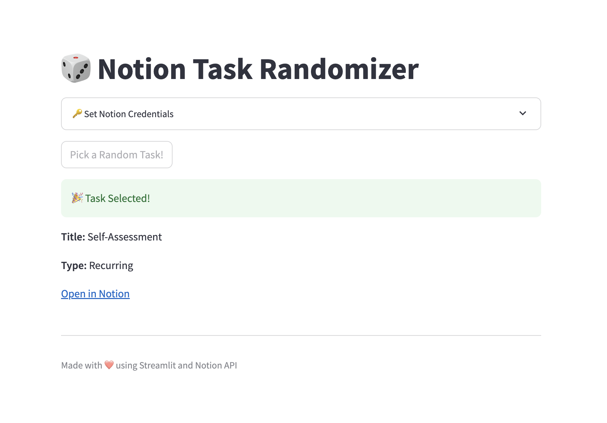

# Notion Task Randomizer

A simple web app that connects to your Notion database and helps you pick a random task to work on.  
Built with Python, Streamlit, and the Notion API.



---

## Features

- 🎲 Randomly selects a task from your Notion database
- 🔗 Direct link to open the task in Notion
- 🖥️ Clean, user-friendly web interface (Streamlit)
- 🔒 Secure: credentials are not stored

---
## Getting Started

### Prerequisites

- Python 3.8+
- A Notion integration token ([how to get one](https://developers.notion.com/docs/create-a-notion-integration))
- Your Notion database ID ([how to find it](https://developers.notion.com/docs/working-with-databases))

### Installation

1. **Clone the repository:**
    ```bash
    git clone https://github.com/linakirsanova/notion-task-randomizer.git
    cd notion-task-randomizer
    ```

2. **Install dependencies:**
    ```bash
    pip install -r requirements.txt
    ```

3. **Set up environment variables:**
    - Create a `.env` file in the project root:
      ```
      NOTION_TOKEN=your_secret_notion_token
      DATABASE_ID=your_notion_database_id
      ```

---

## Usage

1. **Run the app:**
    ```bash
    streamlit run app.py
    ```

2. **Open your browser** (Streamlit will show a local URL, usually [http://localhost:8501](http://localhost:8501))

3. **Enter your Notion credentials** (if not set in `.env`), and click “Pick a Random Task!”